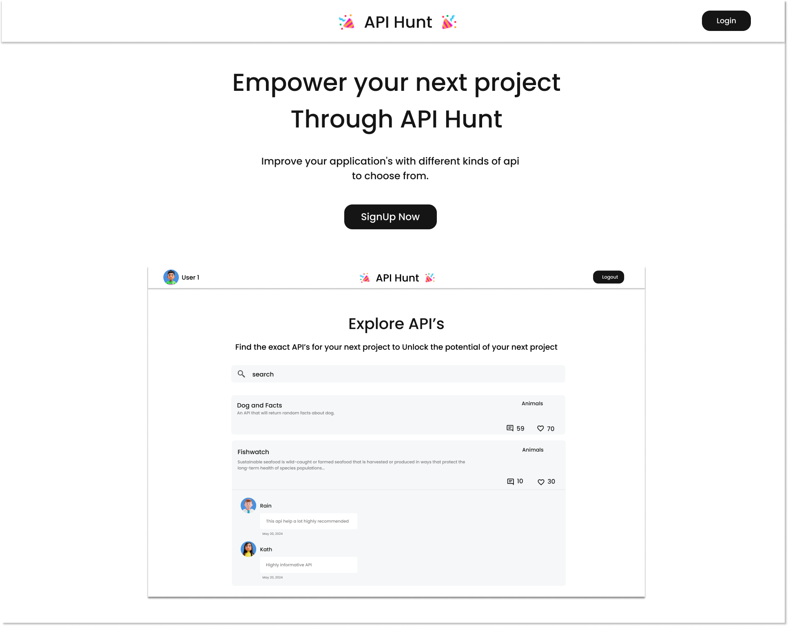

# readme.md

API Hunt is a web app that you can browse free api's for your next projects. using MERN stack

Figma Link
https://www.figma.com/design/1qYOtHOsJKhglQHQcUvHf0/Untitled?node-id=48-1324&t=NvH1ppdIkrWTAF6s-1

## How to Install and Set up

how to set up the project

to install all packages and dependcies
```bash
cd api_hunt
cd frontend
npm i 
```
```bash
cd api_hunt
cd backend
npm i 
```

## how set up localhost and mongo db
```bash
cd api_hunt
cd backend
create a .env file
```
    
inside the .env file
```bash
  .env
  PORT=3000
  MONGO_URI=<ur mongo db connection string>
```

## Insert Data 
open the use the data.json list to insert first using
```bash
const api = require('../models/APIListModel');
const data = [];

const initializeData = async (req, res) => {
  try {
    const result = await api.insertMany(data); // Changed 'res' to 'result' to avoid redeclaration
    return res.json({ message: 'Data Inserted Successfully', result });
  } catch (err) {
    return res.status(500).json({ error: err.message });
  }
};

mongoose
  .connect(MONGO_URI, { useNewUrlParser: true, useUnifiedTopology: true })
  .then(() => {
    console.log('DB Successfully connected'.blue);
    initializeData();
  })
  .catch(err => {
    console.log('DB connection failed'.red);
    console.error(err); // Log the error for debugging
  });
```

##how to run
```bash
  cd backend
  npm start
  wait till the log prints db connected successfull
```

```bash
  cd frontend
  npm run dev
  then click the port
```


how to create or get the mongo db connection string

reference:

link1: https://www.youtube.com/watch?v=pILdgCr4w3s

link2: https://www.youtube.com/watch?v=0Pt7Kfh78Jg&t=564s
## Tech Stack

**Client:** Typescript, React, Redux, TailwindCSS

**Server:** Node, Express, MongoDB


## Authors

github
- [@japoy143](https://github.com/japoy143)

linkedIn

- [@rainierlesondato](https://www.linkedin.com/in/rainierlesondato/)


